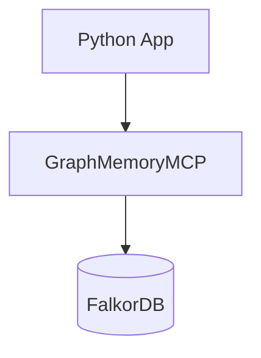
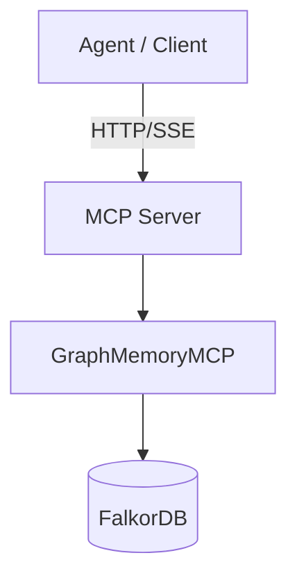

# Examples

This directory contains usage patterns for **graph-memory-mcp** in three integration modes:

- Direct Python integration
- MCP over Streamable HTTP
- External MCP runtime configuration

**Prerequisite:** FalkorDB must be running before any example.

```bash
docker run -p 6379:6379 -it --rm falkordb/falkordb
```

Install the package in editable mode:

```bash
pip install -e .
```

---

## Integration Modes

| Mode | When to use | Server process | Transport | Example |
|------|-------------|---------------|----------|--------|
| **Direct Python** | LangGraph / RAG / pipelines inside Python | No | In-process calls | `embedded_python_usage.py` |
| **HTTP MCP Server** | Agents connect to memory service | Yes | Streamable HTTP | `run_server.py` |
| **HTTP MCP Client** | Testing / agent integration | Requires server | Streamable HTTP | `http_client_usage.py` |
| **MCP Runtime Config** | HTTP-capable MCP runtimes | External server | Streamable HTTP | `mcp_servers_config.json` |

---

## 1. Direct Python Integration (Recommended for Python apps)

Runs Graph Memory as a library, not a service. No HTTP, no MCP client — tools are called directly.

**Run example:**
```bash
uv run --env-file .env python examples/embedded_python_usage.py
```

**Concept:**

```mermaid
graph TD
    App[Python App] --> GM[GraphMemoryMCP]
    GM --> DB[(FalkorDB)]
```

**Example call:**
```python
server = GraphMemoryMCP(config)
result = server.create_node(
    text="Example fact",
    node_type="Fact",
    owner_id="demo_owner",
)
```

**Best for:**
- LangGraph agents
- RAG pipelines
- Batch ingestion
- Tests

---

## 2. HTTP MCP Server

Runs Graph Memory as a standalone MCP service.

**Start server:**
```bash
uv run --env-file .env python examples/run_server.py
```

**Server endpoints:**
- `http://127.0.0.1:8000/mcp` (MCP Streamable HTTP endpoint)

**Concept:**

```mermaid
graph TD
    Agent[Agent / Client] -- HTTP/SSE --> MCP
    MCP[MCP Server] --> GM[GraphMemoryMCP]
    GM --> DB[(FalkorDB)]
```

**Best for:**
- Multi-agent systems
- Remote memory service
- Container deployment
- Service isolation

---

## 3. HTTP MCP Client Example

Demonstrates how to connect to the MCP server using the Python MCP SDK.

**1. Start server first:**
```bash
uv run --env-file .env python examples/run_server.py
```

**2. Then run client:**
```bash
uv run --env-file .env python examples/http_client_usage.py
```

**Example tool call:**
```python
async with streamable_http_client("http://127.0.0.1:8000/mcp") as (read, write, get_session_id):
    async with ClientSession(read, write) as session:
        await session.call_tool("create_node", arguments={...})
```

---

## 4. MCP Client Configuration

`mcp_servers_config.json` shows the essential values for runtimes that support
connecting to an existing Streamable HTTP MCP server by URL.

Important:

- This is **not** a universal copy-paste config for every client.
- Some MCP clients support only stdio servers, not remote HTTP servers.
- If your client supports remote MCP over HTTP, point it to `http://127.0.0.1:8000/mcp`.

**Example configuration:**
```json
{
  "mcpServers": {
    "graph-memory-mcp": {
      "transport": "streamable_http",
      "url": "http://127.0.0.1:8000/mcp"
    }
  }
}
```

---

## 5. CLI Usage

The server can be run directly using the CLI:

```bash
uv run graph-memory-mcp

# Custom host/port
uv run graph-memory-mcp --host 0.0.0.0 --port 8100
```

Note:

- The CLI and `examples/run_server.py` both serve the MCP endpoint at `/mcp`.

---

## Summary

There are two primary ways to use Graph Memory:
- **As a Python library**: Simplest and fastest. Preferred unless you need process isolation or remote access.
- **As an MCP service**: For agents and distributed systems.
